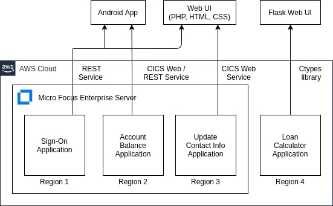

# Target Architecture

> Please read the [Original Architecture](../Original) to understand the target architecture.

## Business Rules

The target architecture of this project is determined by the services that we want to create and how we want to expose them to the user.
To identify the service candidates, a thorough understanding of the original architecture and code is required which could then be translated into business rules.

Business rules are advanced way of documenting the code with additional info like the overall action that a set of lines perform.
They help both the developer and the analyst to get a better and a more complete understanding of the code.
Since they provide a more complete picture, service candidates can be easily identified using them.

Business rules are created using [Enterprise Analyser and Business Rule Manager](../../../Notes%20and%20Research/Tools.md).

## Service Candidates

After analysing the code and creating business rules, the following 4 service candidates were identified:

1. User Sign-on service
1. Account Balance service
1. Update Contact Information service
1. Loan Calculator service

All these services will be deployed in their own Enterprise Server region on an AWS cloud server. This will mean that they are logically independent and could in fact be deployed on separate compute instances with little to no changes.

### User Sign-on service

This service verifies the username and password and validates the user. It is the starting point in the original application.
While it is an independent service, it also is a requirement for utilising some other services.
Because of this, this service will be utilised by different other services which may have entirely different UI built using different technologies.
Therefore, this service will be deployed as **REST API**.

### Account Balance service

As the name suggests, this service lets a validated user check his/her account balance and transactions.
Since the user has to be validated, it uses the user sign-on service.
Just for the purpose of showing the possibilities of modernisation, this service will an **Android App** as it's UI.
The communication between the app and the Enterprise Server region will happen in JSON.

### Update Contact Information service

This service is similar to Account Balance and let's a validated user update their contact info. It also uses user sign-on service for validation.
Again a show of possibilities, this service with have a **Web App** UI. This is UI will be built using pure HTML, CSS and PHP.
The communication with the region will happen in JSON.

### Loan Calculator service

This is a pure COBOL service. It does not uses any data source and as such is completely independent from everything else.
It has the interesting possibility of being converted into a **Dynamically Loaded Library** which is called by a program written in a separate language.
Thus, this service will have a Web App UI built in Python using Flask.

## Conclusion

The overall picture of these services and their UI looks like this:

The goal of this target architecture is to not only modernise the legacy application but to flesh out and exhibit the possibilities of mixing different popular technologies with the COBOL application.

_One thing to consider is that this architecture results in some data redundancies. There are solutions to resolve this but data migration of a legacy COBOL application is not easy and will be considered near the end of this project._
