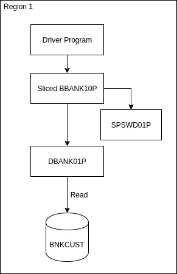
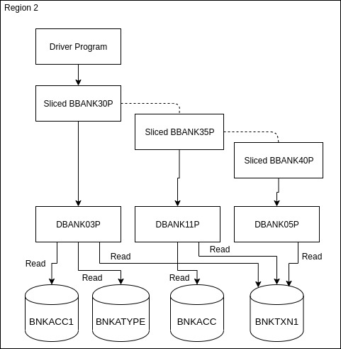
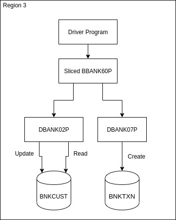
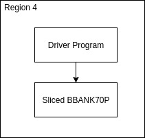

# Detailed Design

> Please read the [Target Architecture](../Architecture/Target) first to get a better understanding.

As it's already mentioned, this project aims to modernise a legacy banking application into 4 microservices with modern UI created using different technologies.

This document aims to document these 4 services in more details, by elaborating on their working within their Enterprise Server region. It will specify what programs are there, what data files are present and what operation are performed on the data files by the program.

## User Sign-on Service

The centre of this service is the `Sliced BBANK10P` program. It's a _sliced_ program as the essential components of `BBANK10P` have been extracted using Enterprise Developer which implement the logic of the sign-on service.

Then there is the associated `DBANK10P` program which performs the data operation, read, on the `BANKCUST` data file.

`SPSDW01P` is a utility program used by `BBANK10P` for the sign-on service.

The is an additional driver program which will connect the `Sliced BBANK10P` to the REST API. This is program will be written as part of the project.

## Account Balance Service

This service has three components:

1. Viewing the user details and account type information, which is handled by `Sliced BBANK30P`.
1. Viewing the balance and details of a particular account type, which is handled by `Sliced BBANK35P`.
1. Viewing the transactions made through an account type, if available, which is handled by `Sliced BBANK40P`.

`DBANK03P`, `DBANK11P` and `DBANK05P` handle the data operations of `BBANK30P`, `BBANK35P` and `BBANK40P` respectively. All the data operations are read and a program reads more than 1 data file.

A driver program will be created to connect this service to CICS Web service or REST API.

## Update Contact Information Service

The centre of this service is the `Sliced BBANK60P` program. It calls two programs `DBANK02P` and `DBANK07P` which perform various data operations like read, create and update on different data files.

The to-be-created diver program will connect this service to the CICS Web service.

## Loan Calculator Service

Being a pure COBOL program without any data operation, its just the `Sliced BBANK70P`.

*Note: The implementation details might change after actual implementation. This document will be updated accordingly.*
