# Steps to Configure an Enterprise Server Region for CICS Web Service

There are multiple ways of creating a new region in the Enterprise Server (ES). You can create one from scratch by yourself, use a template or directly import a server. You can also create copies of other regions that you have.

Here we will create a region and learn how to configure it to serve CICS Web Services (CWS).

1. **Create the region**: Check the "Create an enterprise server region" section of [this guide](https://www.microfocus.com/documentation/enterprise-developer/ed70/ED-Eclipse/GUID-FD3A1AAE-C537-4E19-96DE-A063BC61C3C7.html) to create your region from the template.
1. **Start the region**: Right-click on the region to start it.
2. **Open the Administration page**: On the Server Explorer, right-click `Local[localhost:86]` and then click `Open Administration Page`.
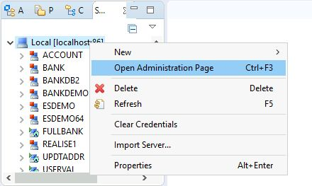
3. **Open details of the region**: Scroll down to reach your region and click `Details`.
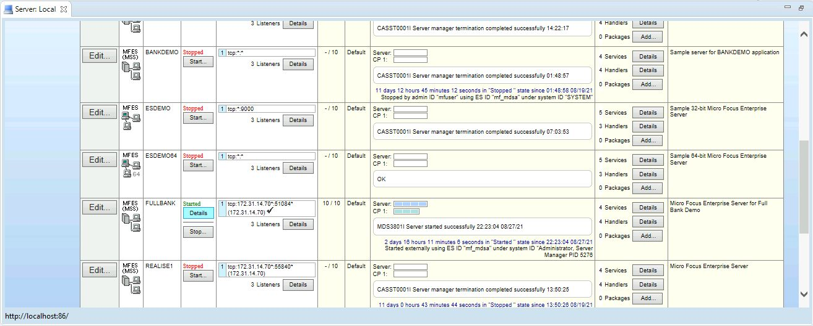
4. **Open ES Monitor And Control**: Click on `ES Monitor and Control`.
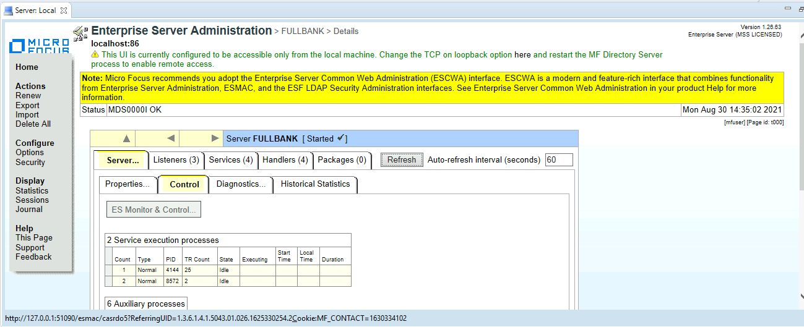
5. **Open by Group**: Under `Resources` select `by Group`.
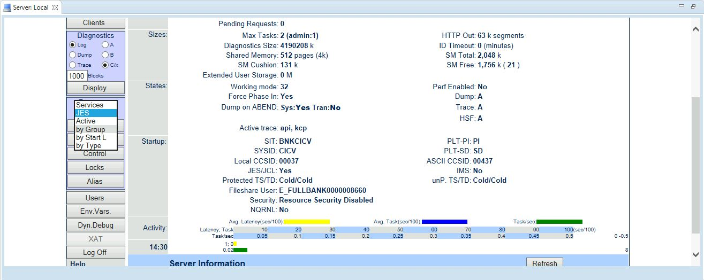
6. **Open Startup List**: Scroll down and click `Startup Lists` to open the list of startup lists available to the server.
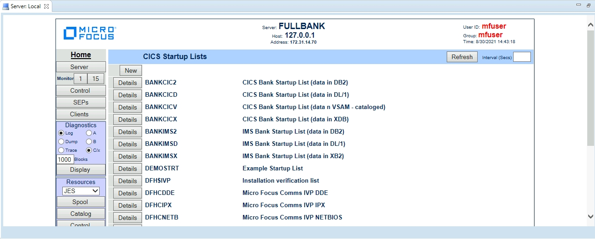
7. **Check details of DEMOSTRT**: Scroll down and click the `Details` of the startup list `DEMOSTRT` because this what your region is using. If your region is using some other list click that.
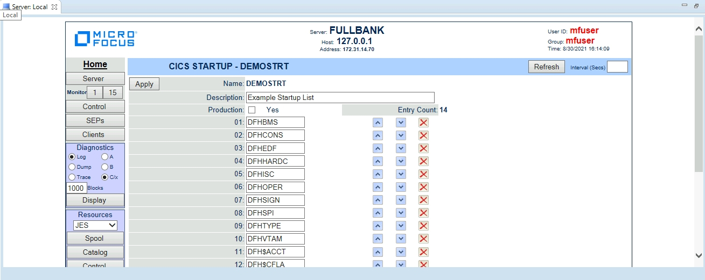
8. **Add DFHWEB, DFHPIPE and JSONPROV**: Scroll down to find an empty block and write `DFHWEB` there and click `Apply`. Similarly, add `DFHPIPE` and `JSONPROV` groups in the startup list.
CICS Web Services are built on top of the CICS Web Interface (CWI) support, so you need to ensure that all CWS and CWI resources are available. These reside in the `DFHPIPE` and `DFHWEB` resource groups respectively, which are already defined, but not included in the startup list. Here we added them along with a user defined group that we are going to create now.
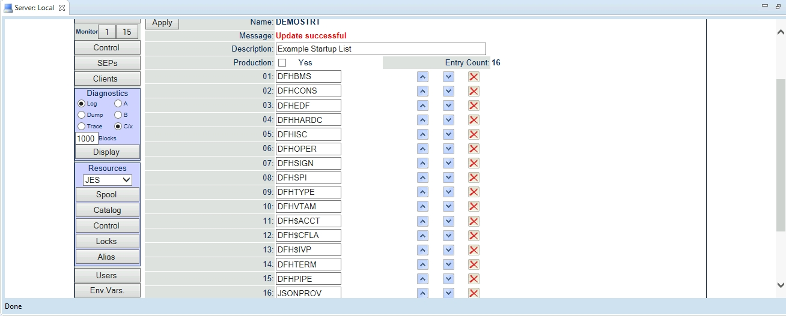
9. **Open groups**: Next under `Resources` select `by Group` and click on `Groups`.
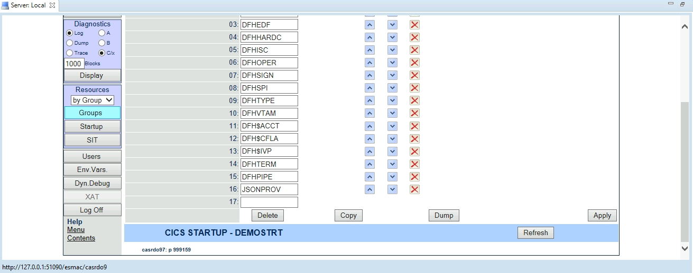
10. **Add new Group JSONPROV**: On the `CICS Resource Groups` page, click `New` and fill the details as given below:
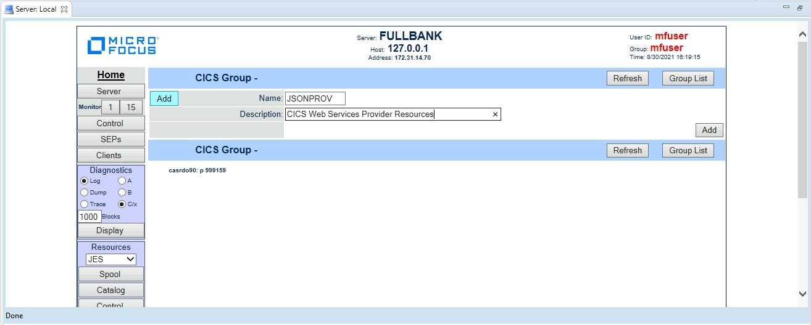
11. **Add TCPIPSrv**: On the `CICS Group JSONPROV` page, click `TCPIPSv` and fill the details as below:
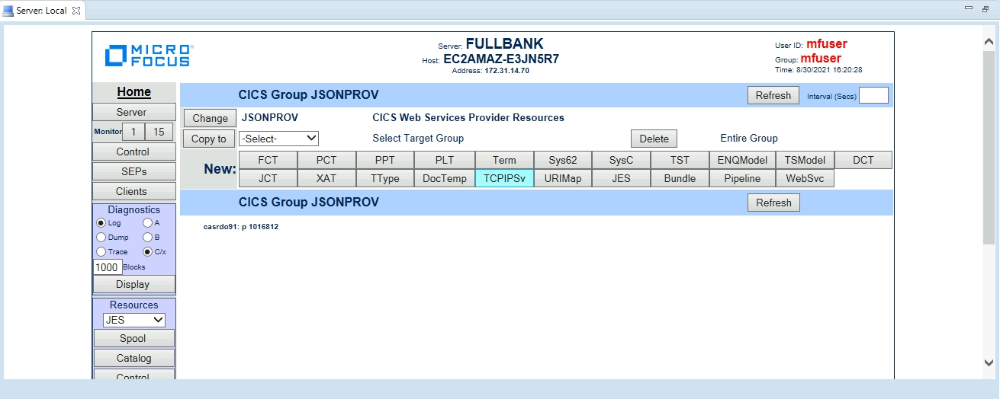
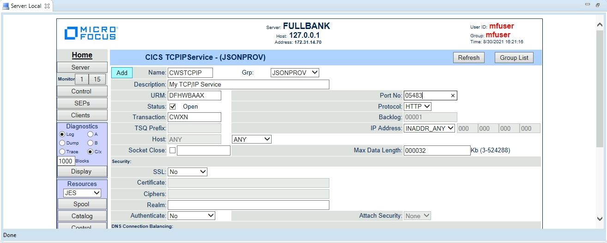
12. **Add JSONPIPE**: On the `CICS Group JSONPROV` page, click `PIPELINE` and fill the details as below:
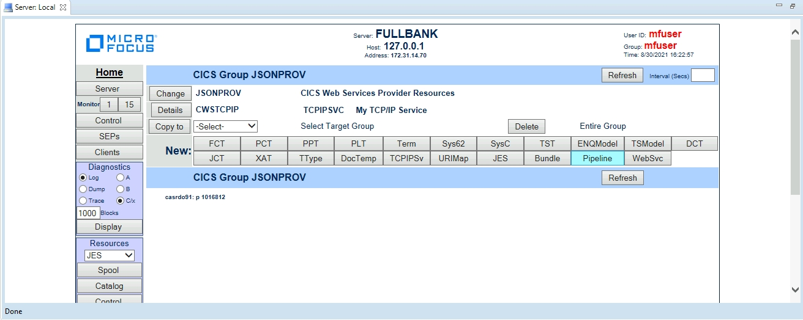
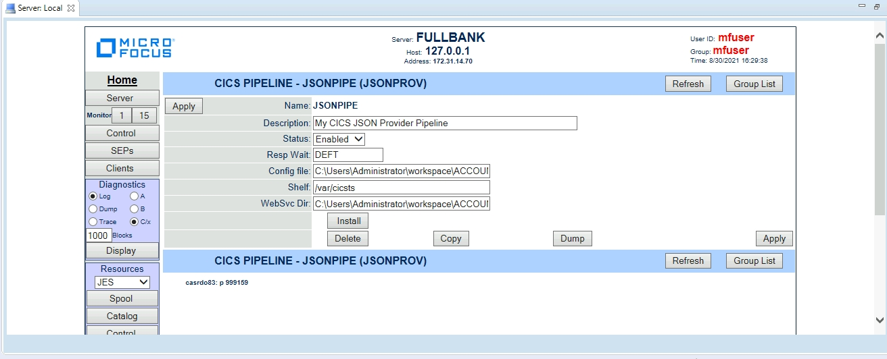
13. **Stop and associate with project**: Right click on the server name in the `Server Explorer` tab and click `Stop`. After the region has stopped, right click again and associate the region with your project:
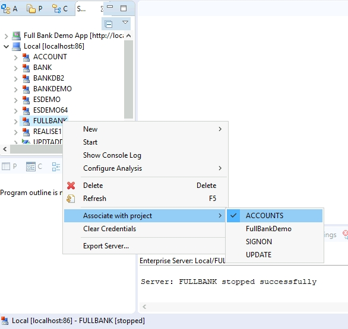
14. **Start and Open ESMAC**: Start the region again and go to `ES Monitor and Control` to verify your configurations.
