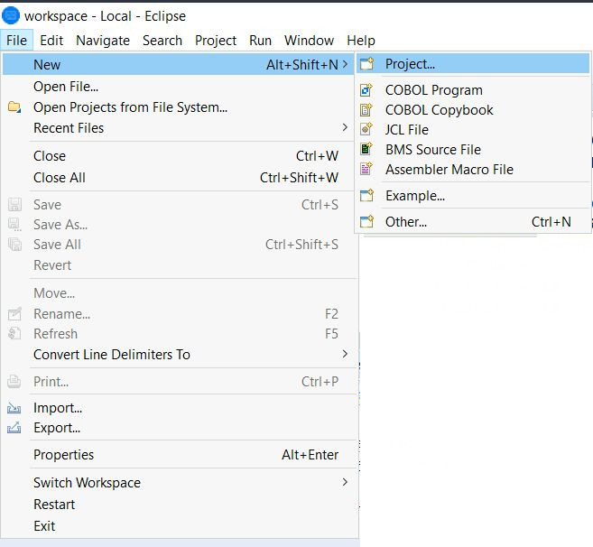
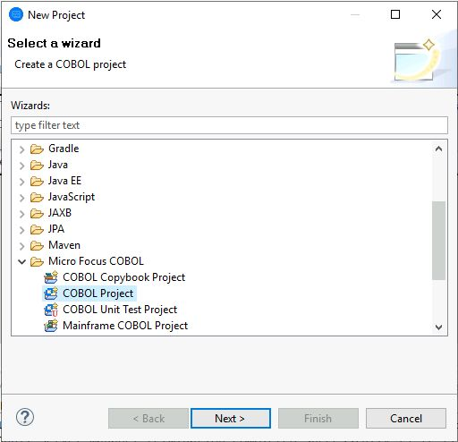
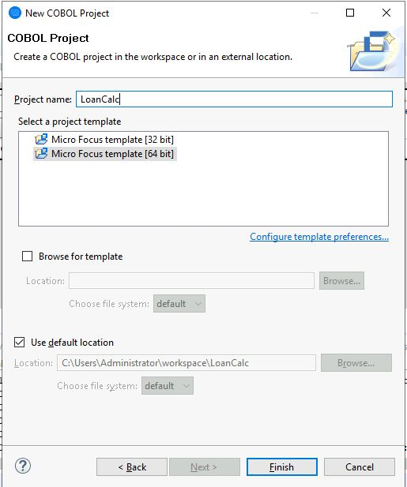
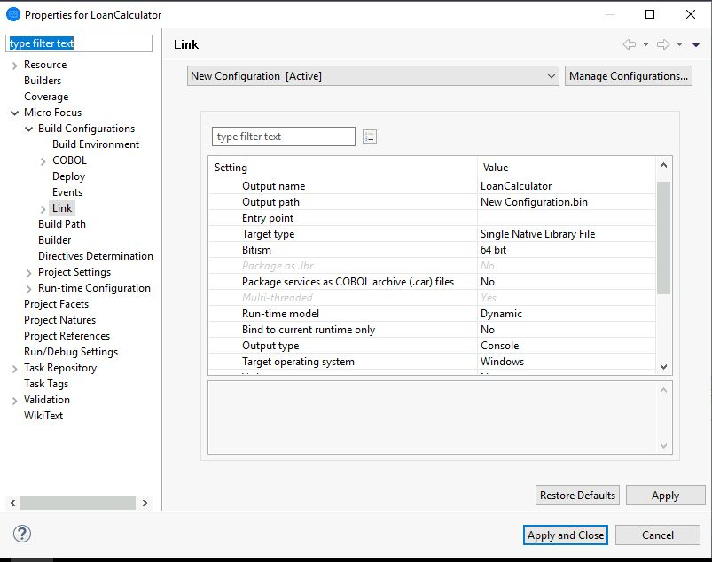
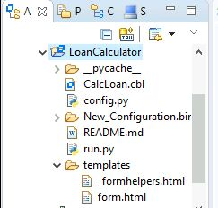

# Instructions for Building the Native Library from COBOL Code

1. Create a new project in Micro Focus Enterprise Server(ES) using **File -> New -> Project**:

2. Select "COBOL Project" under "Micro Focus COBOL" in the new windows:

3. Give your project a name and select the `Micro Focus template [64 bit]` (this is important as we are working with 64 bit Python):

4. Right click on the newly created project and open Properties. Set the following parameters:
	- Target type = `Single Native Library File`
	- Run-time model = `Dynamic`
	- Bind to current runtime only = `No`

5. Then click and drag the files from Windows Explorer to the project and Copy them into the project directory. After which the project directory should look like this:

6. Build the project and you should get the native library file `LoanCalculator.dll` in `New_Configuration.bin`.
